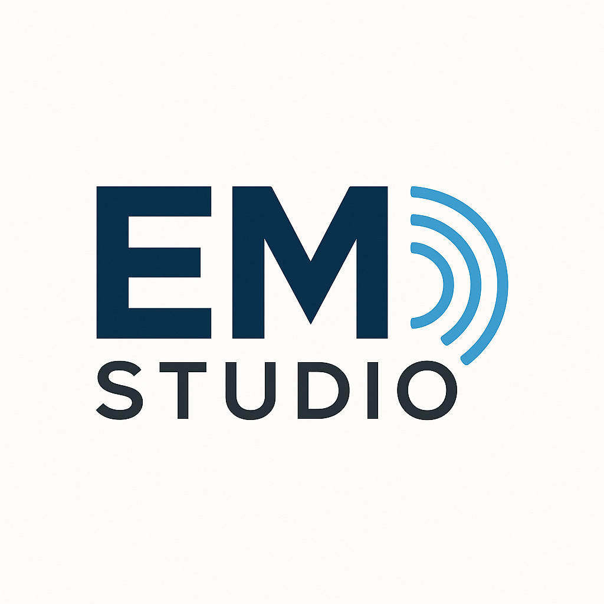

# 📘 EMStudio – User Guide & Developer Documentation

<p align="center">
  
</p>

<h1 align="center">EMStudio</h1>

<p align="center">
  Qt-based GUI for electromagnetic (EM) simulations  
  Developed at IHP Microelectronics
</p>

---

# Overview

**EMStudio** is a Qt-based desktop application for preparing, visualizing, and managing electromagnetic simulations.

It provides an integrated workflow for:

- Loading GDS layout data  
- Defining and editing substrate stacks (dielectrics, metals, layers)  
- Visualizing a 2.5D cross-section  
- Configuring simulation parameters  
- Generating configuration files for EM solvers (OpenEMS, Palace)  
- Editing Python driver scripts with syntax highlighting  
- Running simulations and streaming log output

---

# Features

- Cross-platform Qt GUI (Linux & Windows)  
- GDS reader (`gdsreader.cpp`)  
- Substrate & material model  
- 2.5D stack visualization (`substrateview`)  
- Python script editor with syntax highlighting & autocompletion  
- Python/Palace parser with JSON configuration  
- QtPropertyBrowser-based parameter editor  
- Preferences dialog (paths, solver settings, Python interpreter)  
- Command-line interface for automation  

---

# Running EMStudio (Standalone)

You can launch **EMStudio.exe** directly or via terminal:

```bash
EMStudio.exe [options] [run_file.json]
```

### Command-line options

- **`-gdsfile <path>`**  
  Path to GDS file

- **`-topcell <name>`**  
  Top-level GDS cell

- **`run_file.json` (optional)**  
  If provided, its settings override CLI arguments.  
  If omitted, EMStudio automatically loads `<topcell>.json`  
  from the same folder as the GDS file (if it exists).

### Example

```bash
EMStudio.exe -gdsfile "C:/Work/design.gds" -topcell "top"
```

---

# KLayout Integration

EMStudio can be launched directly from **KLayout** through the helper script:

```
scripts/klEmsDriver.py
```

## Usage

1. Save `klEmsDriver.py` inside your EMStudio installation directory.  
2. (Optional) Add EMStudio directory to your system PATH.  
3. Launch KLayout with:

```bash
"<path>\klayout_app.exe" -e -rm "<path>\EMStudio\scripts\klEmsDriver.py"
```

### What happens when executed?

- EMStudio receives the currently opened GDS layout  
- The top cell name is passed automatically  
- If `<topcell>.json` exists next to the GDS, EMStudio loads it  

---

# Desktop Shortcut (Windows)

1. Right-click → **New → Shortcut**
2. Set target:

```text
"<Path to KLayout>\klayout_app.exe" -e -rm "<Path to EMStudio>\scripts\klEmsDriver.py"
```

3. Name it e.g. **EMStudio via KLayout**  
4. *(Optional)* Change the icon: `icons/logo.ico`

---

# Configuration Files

EMStudio uses JSON-based configuration files (`*.json`) containing:

- GDS file path  
- Top cell  
- Frequency range  
- Mesh settings  
- Substrate definition  
- Port definitions  
- Output directory  
- Python script path  

These files can be created or edited in EMStudio and reused for automated runs.

---

# Building EMStudio

## Build from command line (Linux)

```bash
cd /path/to/EMStudio
qmake EMStudio.pro
make -j$(nproc)
./EMStudio
```

---

## Build from command line (Windows / MSVC)

```cmd
qmake EMStudio.pro
nmake
release\EMStudio.exe
```
