# 📘 EMStudio – User Guide & Developer Documentation

<p align="center">
  
</p>

<h1 align="center">EMStudio</h1>

<p align="center">
  Qt-based GUI for electromagnetic (EM) simulations  
  Developed at IHP Microelectronics
</p>

---

# Overview

**EMStudio** is a Qt-based desktop application for preparing, visualizing, and managing electromagnetic simulations.

It provides an integrated workflow for:

- Loading GDS layout data  
- Defining and editing substrate stacks (dielectrics, metals, layers)  
- Visualizing a 2.5D cross-section  
- Configuring simulation parameters  
- Generating configuration files for EM solvers (OpenEMS, Palace)  
- Editing Python driver scripts with syntax highlighting  
- Running simulations and streaming log output

---

# Features

- Cross-platform Qt GUI (Linux & Windows)  
- GDS reader (`gdsreader.cpp`)  
- Substrate & material model  
- 2.5D stack visualization (`substrateview`)  
- Python script editor with syntax highlighting & autocompletion  
- Python/Palace parser with JSON configuration  
- QtPropertyBrowser-based parameter editor  
- Preferences dialog (paths, solver settings, Python interpreter)  
- Command-line interface for automation  

---

# Installation

## Pre-built binaries (Windows)

A ready-to-use **Windows installer** is produced by the CI pipeline.

You can download it from **GitHub → Actions → Workflows → latest successful run**.  
In the workflow artifacts (job `build-windows`) you will find the Windows installer.

> Linux users typically build EMStudio from source (see below).

---

## Build from source (Linux)

```bash
cd /path/to/EMStudio
qmake EMStudio.pro
make -j$(nproc)
./EMStudio
```

---

## Build from source (Windows / MSVC)

```cmd
cd \path\to\EMStudio
qmake EMStudio.pro
nmake 
.\release\EMStudio.exe
```

---

## External solvers (required for full functionality)

EMStudio integrates with external electromagnetic solvers.  
For full functionality, these tools must be installed separately by the user.

Please ensure the solvers are available in your `PATH`, or configure their locations explicitly in the EMStudio settings.

### openEMS

EC-FDTD electromagnetic solver.

- Project page: https://www.openems.de/
- Documentation: https://docs.openems.de/
- Source code & build instructions: https://github.com/thliebig/openEMS-Project

### Palace

Parallel finite-element electromagnetic solver.

- Project page & documentation: https://awslabs.github.io/palace/
- Source code: https://github.com/awslabs/palace

---

# Running EMStudio (Standalone)

You can launch **EMStudio.exe** directly or via terminal:

```bash
EMStudio.exe [options] [run_file.json]
```

### Command-line options

- **`-gdsfile <path>`**  
  Path to GDS file

- **`-topcell <name>`**  
  Top-level GDS cell

- **`run_file.json` (optional)**  
  If provided, its settings override other commandline arguments.  
  If omitted, EMStudio automatically loads `<topcell>.json`  
  from the same folder as the GDS file (if it exists).

### Example

```bash
EMStudio.exe -gdsfile "C:/Work/design.gds" -topcell "top"
```

---

# KLayout Integration (method 1)

EMStudio can be launched directly from **KLayout** through the helper script:

```
scripts/klEmsDriver.py
```

## Usage on Linux

1. Save `klEmsDriver.py` inside your EMStudio installation directory.  
2. (Optional) Add EMStudio directory to your system PATH.  
3. Launch KLayout with:

```bash
"<path>\klayout_app.exe" -e -rm "<path>\EMStudio\scripts\klEmsDriver.py"
```

## Desktop Shortcut (Windows)

1. Right-click → **New → Shortcut**
2. Set target:

```text
"<Path to KLayout>\klayout_app.exe" -e -rm "<Path to EMStudio>\scripts\klEmsDriver.py"
```

3. Name it e.g. **EMStudio via KLayout**  
4. *(Optional)* Change the icon: `icons/logo.ico`

# KLayout Integration (method 2)

EMStudio can be launched directly from **KLayout** if you start KLayout using one of the scripts provided in the EMStudio scripts directory:
- `KLayout.bat` for Windows
- `KLayout.sh` for Linux

This will find your KLayout installation by searching the PATH, and then start KLayout with EMStudio integration.

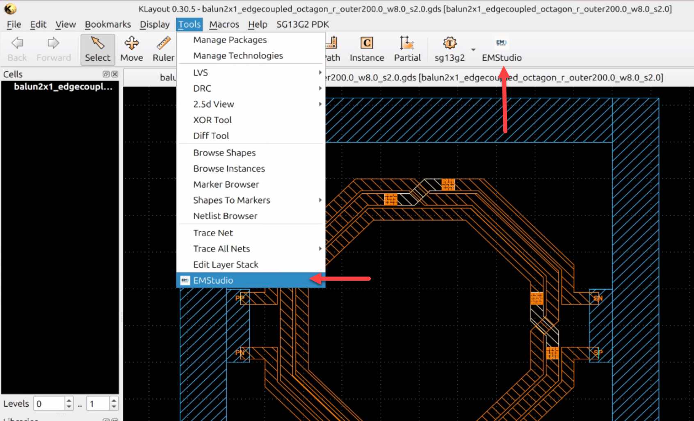

### What happens when executed?

- EMStudio receives the currently opened GDS layout  
- The top cell name is passed automatically  
- If you had already created a simulation model for this layout, you can load it from the history list in File menu


---

# Workflow overview

**EMStudio** is a Qt-based desktop application for preparing, visualizing, and managing electromagnetic simulations.

EMStudio can be started stand-alone, or from the klayout layout editor.

After simulation settings and port configuration are configured, 
EMStudio can save a simulation model to disk, and also start simulation. The simulation model requires the **solver workflow folder**
('modules' for openEMS, 'gds2palace' for Palace) and the **stackup file** (*.XML)
to be present in your target directory. This means you usually want to have 
**one** folder for each solver type (openEMS or Palace) where simulation model scripts are located together with the solver modules folder and the substrate files.

Note that the solver workflow folders are only the "bridge" to openEMS and Palace EM solvers, and you need to have these 
EM solvers installed, as described in the solver documentation. This is no different from using the normal Python script based IHP EM workflows.

Note for advanced users: If you want to create simulation models in different directories, 
and don't want to copy & paste the "modules" or "gds2palace" to each of these folders, you can also include 
these folders in your PYTHONPATH environment variable. For gds2palace, you can also install that using "pip install gds2palace" and update using "pip install gds2palace --upgrade".

# User Interface 

When you start EMStudio, you first need to configure some path settings using **Setup > Preferences** from the main menu. 


## Configuration 

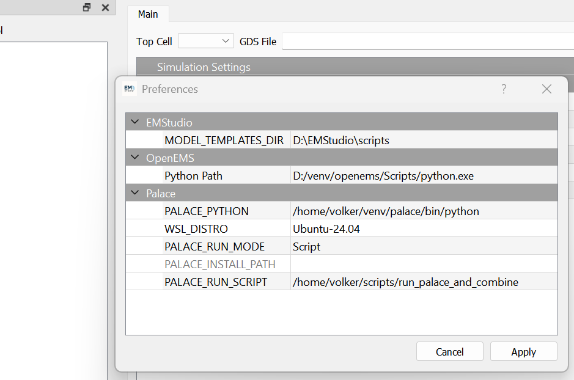


- **Python Path**  
  Path to the Python interpreter used for the **openEMS** workflow. 
  If you installed openEMS and the IHP workflow files into 
  a venv named "openEMS" located in your home directory "home/venv/openEMS", the python interpreter would be "home/venv/openEMS/bin/python"

- **OPENEMS_INSTALL_PATH**  
  This is where you installed openEMS. If you built openEMS according to the defaults, this is "~/opt/openEMS" in your user home directory.

- **PALACE_WSL_PYTHON**  
  Path to the Python interpreter used for the **Palace** workflow.
  If you installed the gds2palace workflow files into 
  a venv named "palace" located in "home/venv/palace", the python interpreter would be "home/venv/palace/bin/python".
  If you don't want to use Palace, you can leave this empty.

- **PALACE_RUN_MODE**  
  This setting is used to define how Palace is started after creating the model files (config.json and *.msh). 
  "Executable" is used if Palace is installed into the normal file system, e.g. using spack installation. 
  "Script" is used if you want/need more control over starting Palace, e.g. because you installed it in an apptainer container, or if you want to send jobs to remote machines. An example run script is shown in the gds2palace repository [here](https://github.com/VolkerMuehlhaus/gds2palace_ihp_sg13g2/tree/main/scripts).

- **PALACE_INSTALL_PATH**  
  This is where you have installed Palace when using the "Executable" run mode.
  If you don't want to use Palace, you can leave this empty.

  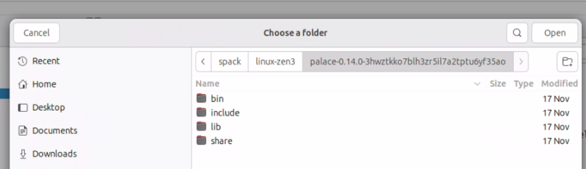

  In this case, Palace will be started with the maximum number of cores available on your system. 

- **PALACE_RUN_SCRIPT**  
  This is the script used to start Palace when using the "Script" run mode.
  If you don't want to use Palace, you can leave this empty.

  

## Main

The main tab is where you configure the layout input file (*.gds) and the main simulation settings. 

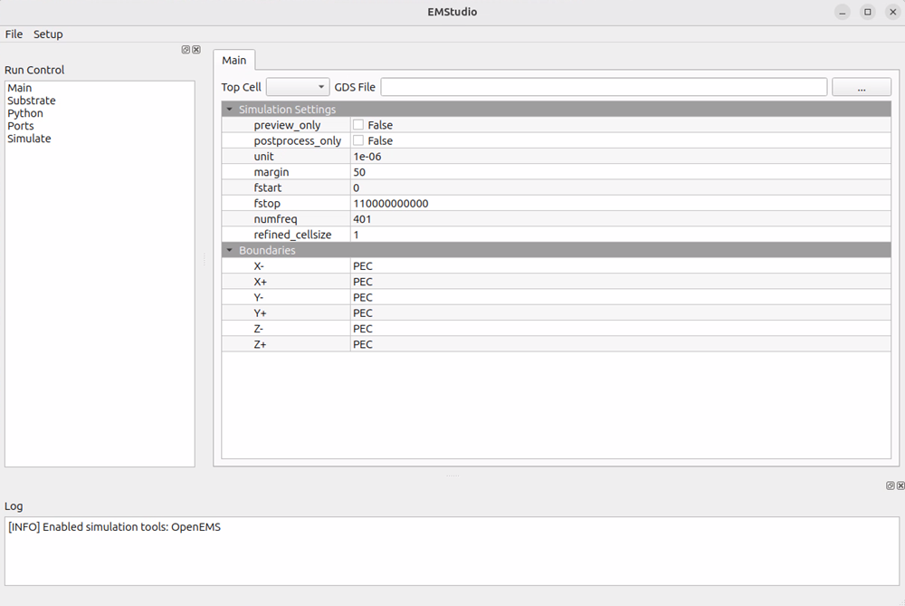

When you start from scratch, the settings grid is almost empty. You can now load a project template using **File > Load Python Model ...** or you can go to the **Python** tab, choose the **simulator** that you want to use and then press **Generate Default**. Before leaving the tab, save your changes using File > Save or Ctrl+S 

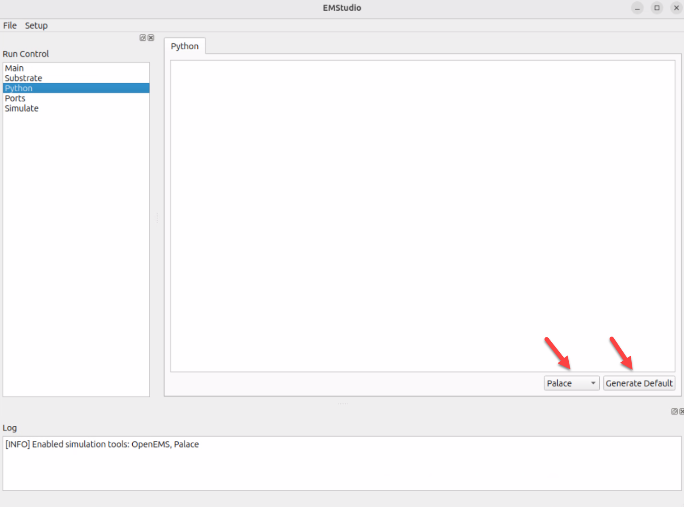

When a valid model is loaded or created from the template, the main tab will look as shown below. Scripts parameters defined using the `settings[]=value` syntax will be shown in the settings grid and can be modified, with bi-directional synchronization to the built-in Python script editor. If the script line provides additional information in a comment, this will be shown as "flyout help" when moving the mouse over that item in the settings grid.

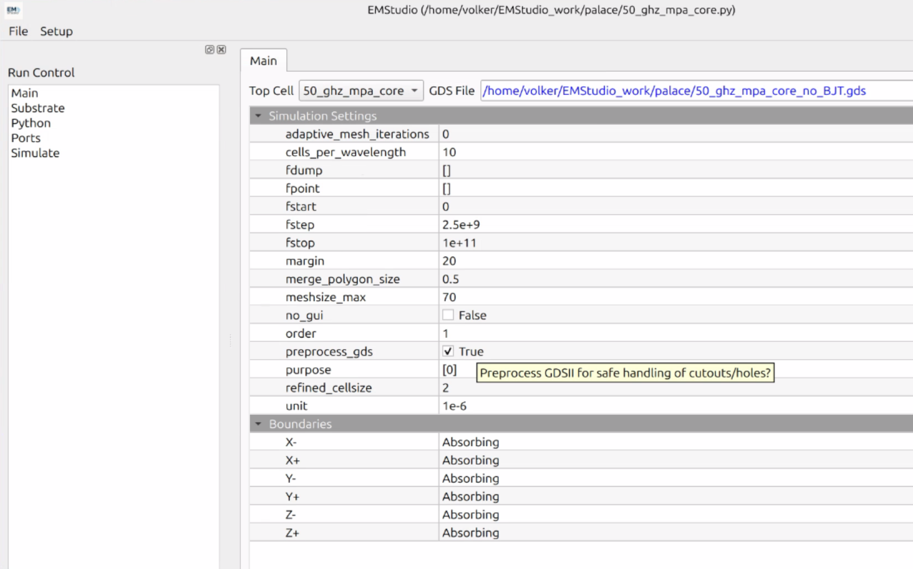

Not all possible settings are included in the template. Adding an additional setting is possible using the script editor on the Python tab. For a full list of available settings[] and their meaning, please refer to the documentation of the IHP openEMS workflow:
https://github.com/VolkerMuehlhaus/openems_ihp_sg13g2/blob/main/doc/Using_OpenEMS_Python_with_IHP_SG13G2_v2.pdf
and IHP Palace workflow gds2palace:
https://github.com/VolkerMuehlhaus/gds2palace_ihp_sg13g2/blob/main/doc/gds2palace_workflow_userguide.pdf

Before leaving any tab, save your changes using File > Save or Ctrl+S 

## Substrate

The substrate tab is where you select the XML stackup file to be used for simulation. EMStudio shows a cross section of the substrate file, and in the background, it prepares the Ports configuration tab using the layer names found in the stackup.

Before leaving any tab, save your changes using File > Save or Ctrl+S 

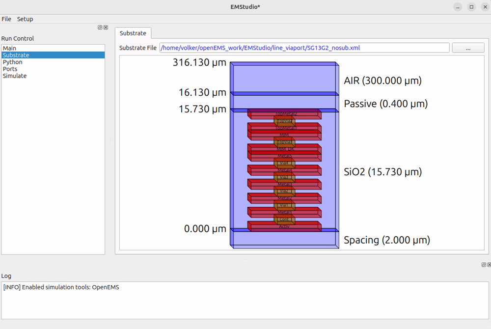

## Python

On the Python tab, you can see the Python model code that is used to run openEMS or Palace workflows. When you start EMStudio, you will see an empty editor window. You can now generate a default model code (Button "Generate Default") or you can load an existing model code (Menu: File > Load Python Model ...). 

Python model templates are read from the  `scripts` folder in EMStudio, with one template each for openEMS and Plaace. You could modify these files if required.

The model code will be synchronized automatically with settings on the "Main" tab, where you can edit your simulation settings. Synchronization works both ways, you can apply changes in the editor on the "Python" tab or in the Settings grid on the "Main" tab.

Before leaving any tab, save your changes using File > Save or Ctrl+S 

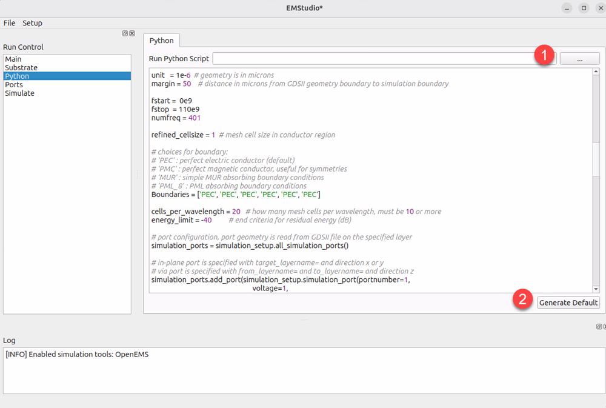

## Ports 

On the ports tab, you need to configure simulation ports. It is expected that ports are included in the GDSII file on special layers, one layer per port, as described in the documentation of the IHP EM workflows. The EM workflows support in-plane ports (in xy plane) and vertical via ports (z direction). The direction of current flow in the port must be set by the user: `x`,`y`,`z` or `-x`,`-y`,`-z` for reverse polarity. Port polarity matters when multiple ports are connected to the same return path.

Before leaving any tab, save your changes using File > Save or Ctrl+S 

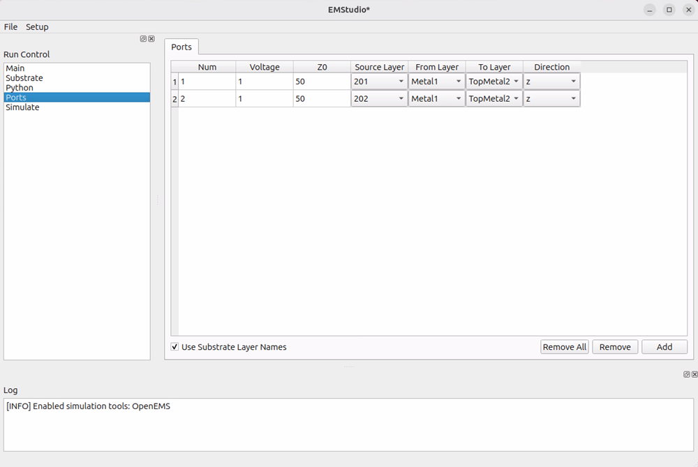

EMStudio will read the GDSII file and scan for polygon layers 201 and above, which is the recommended layer range to create ports for IHP EM workflows. 

When creating ports entries from scratch, there is a checkbox "Use Substrate Layer Names" of the left bottom side of the Window. This will tell EMStudio to use layer names from the XML stackup file for the layer dropdown boxes.

In the GDSII file, in-plane ports (X or Y direction) must be drawn as a rectangle for openEMS and Palace workflow. Vertical ports (Z direction) can be drawn as a zero area box (line) for Palace and openEMS. In addition, openEMS also allows via ports to have an area. 

## Simulate

On the Simulate tab, you can run the model script to generate the EM solver input files and start the simulation model. 

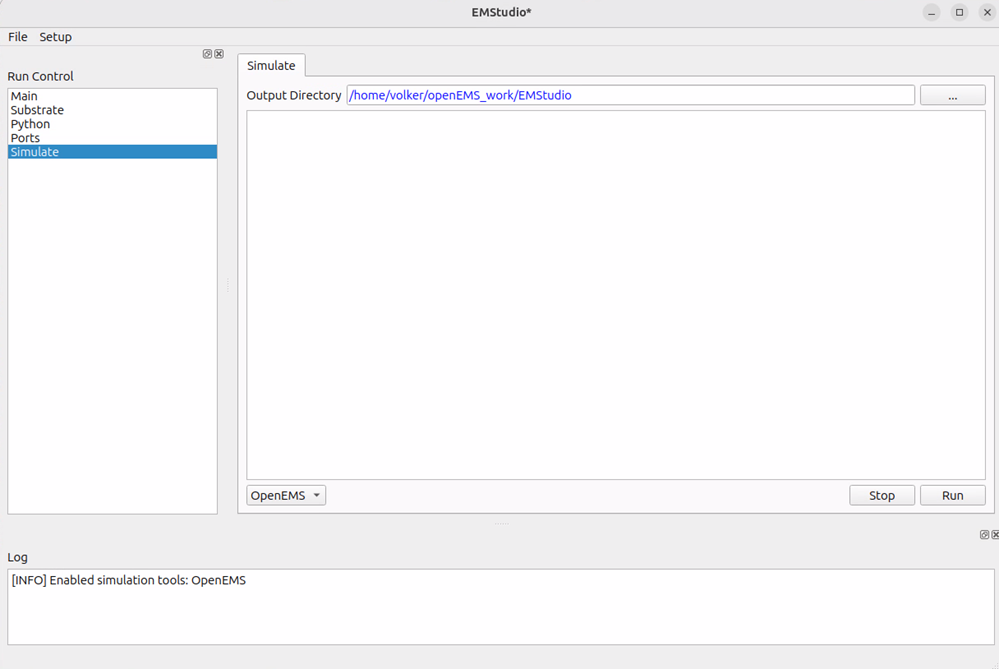

When you press the run button, the simulation model script will be executed, using the Python interpreter that you defined using Setup > Preferences. For openEMS, simulation only starts when setting `preview_only=True` in the simulation model. 

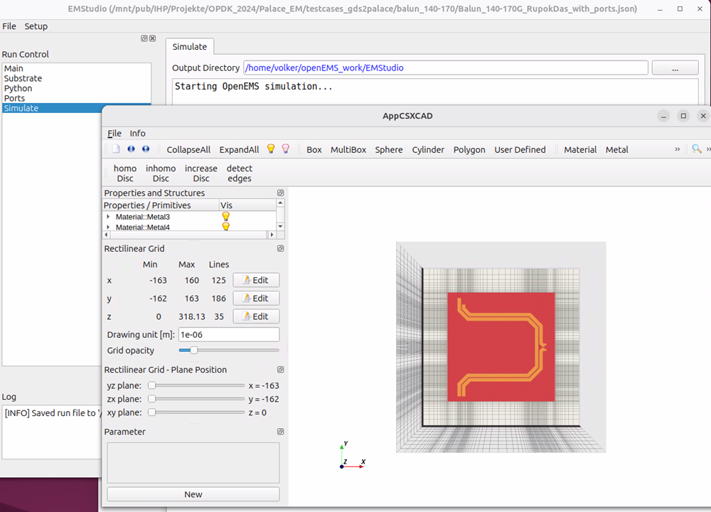

--

## Switching between openEMS and Palace

At present, EMStudio does **not** allow to switch the simulator for an existing model. The simulator choice is fixed after choosing the template.

---


# Example Workflows & Reference Projects

EMStudio is compatible with some publicly available example projects that demonstrate complete EM simulation flows based on **IHP SG13G2** technology.

These repositories provide real-world examples for both **OpenEMS** and **Palace**, including GDS layouts, stackup files, simulation scripts, and S‑parameter extraction.

---

## 1. OpenEMS Example (IHP SG13G2)

**Repository:**  
https://github.com/VolkerMuehlhaus/openems_ihp_sg13g2

This project contains:

- SG13G2 example GDS files  
- SG13G2 technology XML  
- Python simulation scripts  
- OpenEMS mesh and solver setup  
- Post-processing utilities (S-parameters)

### Using with EMStudio

Only the XML stackups from this repository are compatible with EMStudio. Example models provided in this repository do **not** use the `settings[]=value` syntax and **can not** be imported into EMStudio. You need to create models from scratch using the openEMS template provided with EMStudio. 

---

## 2. GDS‑to‑Palace Example (IHP SG13G2)

**Repository:**  
https://github.com/VolkerMuehlhaus/gds2palace_ihp_sg13g2

This repository shows a complete **Palace EM simulation flow** including:

- GDS examples  
- SG13G2 XML substrate  
- Palace Python driver scripts  
- S‑parameter generation  

### Using with EMStudio

Load the Palace Python script via:

```
File → Open Python Model…
```

EMStudio will:

- Parse all Palace simulation settings  
- Import GDS + XML files  
- Load ports and boundaries  
- Provide full editing of simulation parameters  
- Export updated Palace-ready Python script  

---

# Summary

These example repositories are ideal for learning EMStudio workflows and validating correct operation.

EMStudio can be used directly with both OpenEMS and Palace models for:

- Full‑wave EM simulation  
- SG13G2 stack evaluation  
- Port setup & S‑parameter extraction  
- Automated script generation  
- KLayout‑based design environment integration

## License

EMStudio is free software: you can redistribute it and/or modify it under the
terms of the GNU General Public License as published by the Free Software Foundation,
either version 3 of the License, or (at your option) any later version.

See the [LICENSE](LICENSE) file for details.

This project also includes third-party components:

- QtPropertyBrowser – from the Qt Solutions package, licensed under BSD-like terms
